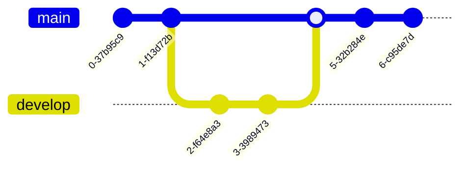
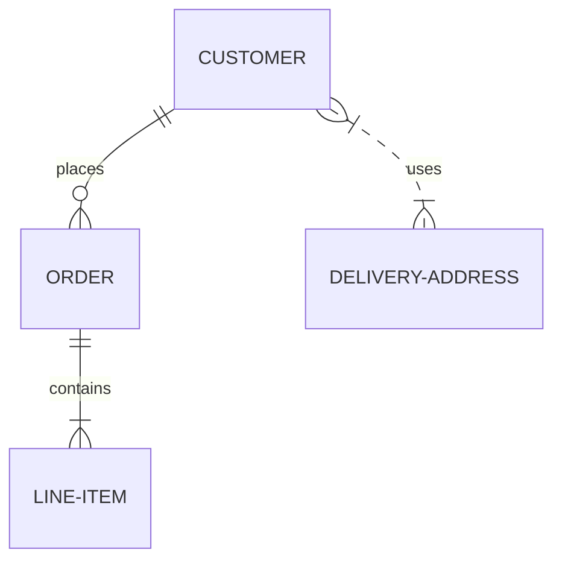

# Advanced Examples

## Complex Mermaid Diagrams

### Git Workflow

<FullscreenDiagram>



</FullscreenDiagram>

### Entity Relationship



## Custom Components


```vue
<script setup>
import { ref } from 'vue'

const count = ref(0)
</script>

<template>
  <button @click="count++">
    Count is: {{ count }}
  </button>
</template>
```


## Advanced Configuration

<FullscreenDiagram>

```typescript
export default defineConfig({
  markdown: {
    config: (md) => {
      // Add custom markdown extensions
    }
  },
  vite: {
    plugins: [
      // Add custom Vite plugins
    ]
  }
})
```

</FullscreenDiagram>