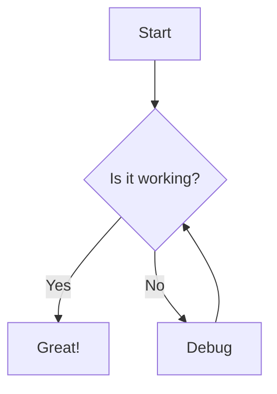
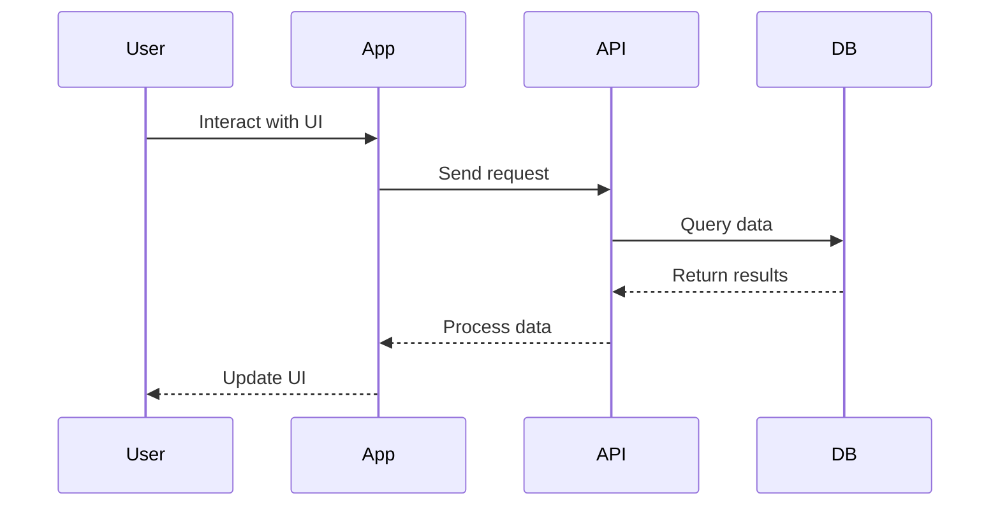

# Another Identical Markdown Features Showcase

This page demonstrates the various Markdown and VitePress features available for documentation.

## Basic Markdown

### Text Formatting

You can use **bold**, *italic*, or ***bold and italic*** text. You can also use ~~strikethrough~~ text.

### Lists

#### Unordered Lists

- Item 1
- Item 2
  - Nested item 2.1
  - Nested item 2.2
- Item 3

#### Ordered Lists

1. First item
2. Second item
   1. Nested item 2.1
   2. Nested item 2.2
3. Third item

### Links

[External link to VitePress documentation](https://vitepress.dev/)

[Internal link to home page](/)

### Images


### Blockquotes

> This is a blockquote.
> 
> It can span multiple lines.

### Horizontal Rule

---

## Code Blocks

### Inline Code

Use the `console.log()` function to log messages to the console.

### Code Blocks with Syntax Highlighting

```javascript
// JavaScript example
function greet(name) {
  return `Hello, ${name}!`;
}

console.log(greet('World'));
```

```python
# Python example
def greet(name):
    return f"Hello, {name}!"

print(greet("World"))
```

```solidity
// Solidity example
contract HelloWorld {
    string public message;
    
    constructor() {
        message = "Hello, World!";
    }
    
    function updateMessage(string memory newMessage) public {
        message = newMessage;
    }
}
```

### Line Highlighting

```javascript{3,5-7}
function example() {
  // This line is not highlighted
  console.log('This line is highlighted');
  // This line is not highlighted
  const highlighted = true;
  if (highlighted) {
    console.log('These lines are also highlighted');
  }
}
```

## Tables

| Feature | Description | Support |
|---------|-------------|---------|
| Tables | Organize data in rows and columns | ✅ |
| Code Blocks | Display formatted code with syntax highlighting | ✅ |
| Math Equations | Render mathematical formulas | ✅ |

## Custom Containers

::: info
This is an info box.
:::

::: tip
This is a tip.
:::

::: warning
This is a warning.
:::

::: danger
This is a dangerous warning.
:::

::: details
This is a details block.
:::

## Math Equations

Inline equation: $E = mc^2$

Block equation:

$$
\frac{\partial u}{\partial t} = h^2 \left( \frac{\partial^2 u}{\partial x^2} + \frac{\partial^2 u}{\partial y^2} + \frac{\partial^2 u}{\partial z^2} \right)
$$

## Diagrams

### Mermaid Diagram



### Custom Component with Fullscreen Support

<FullscreenDiagram>



</FullscreenDiagram>

## Advanced Features

### Table of Contents

[[toc]]

### Frontmatter

You can add frontmatter to your Markdown files to customize the page:

```yaml
---
title: Custom Page Title
description: Page description for SEO
sidebar: auto
---
```

### Custom Components

VitePress allows you to use Vue components directly in your Markdown:

<ContractDiagram />

### Emoji Support

:smile: :rocket: :book:

## Conclusion

This page showcases the various Markdown and VitePress features available for your documentation. Refer to the [VitePress documentation](https://vitepress.dev/) for more details on these features and how to customize them.