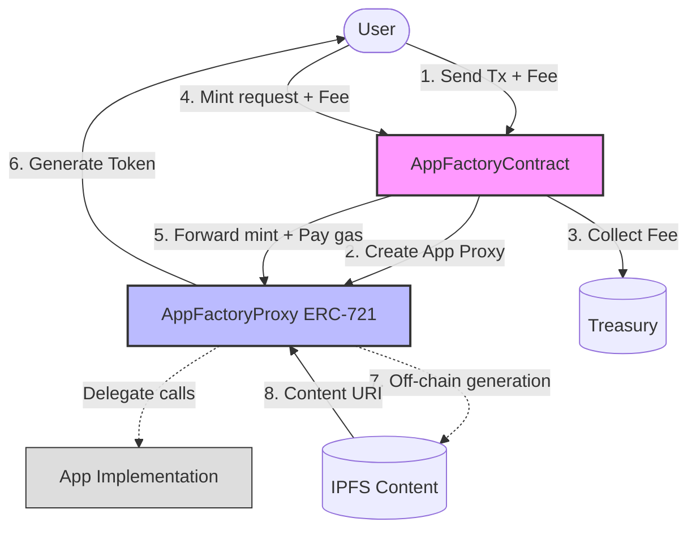
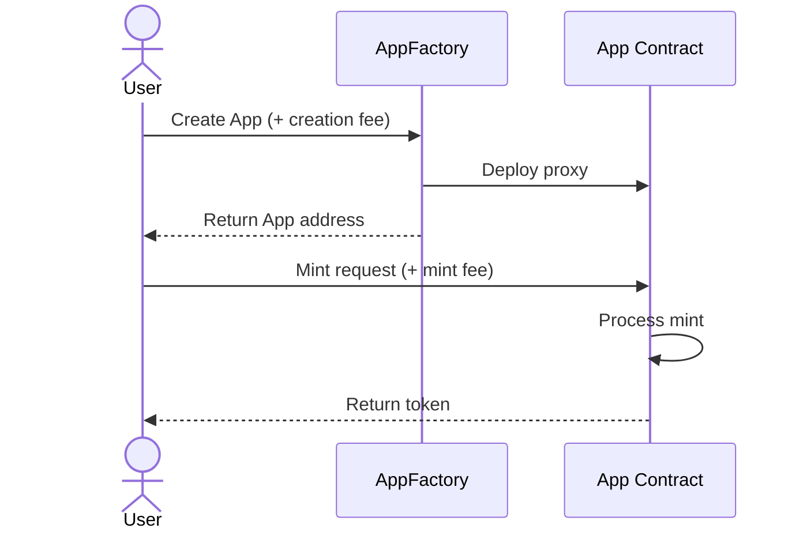
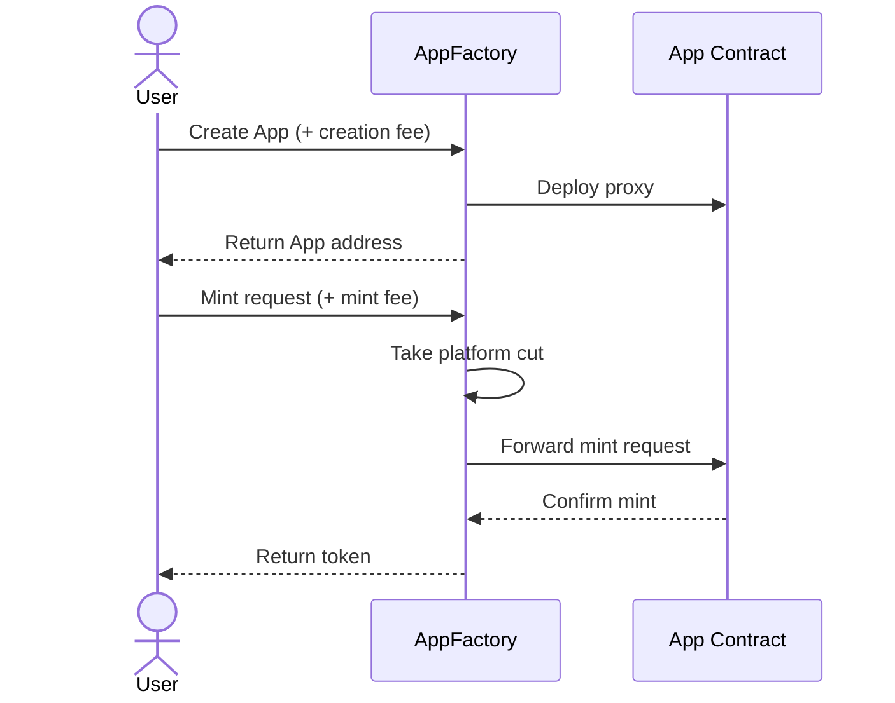
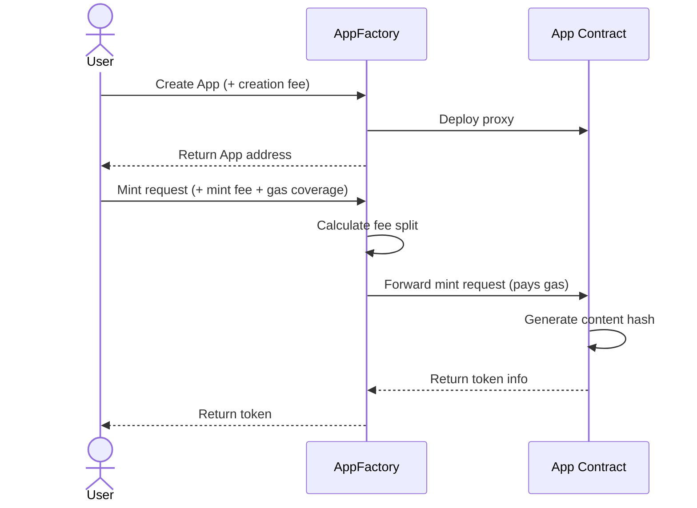
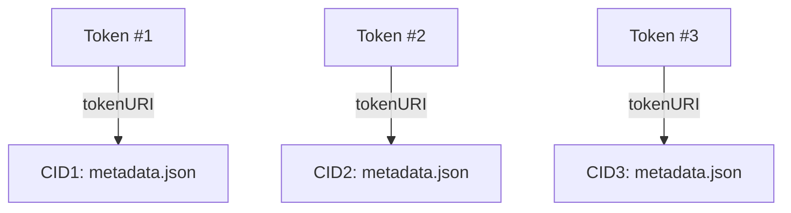
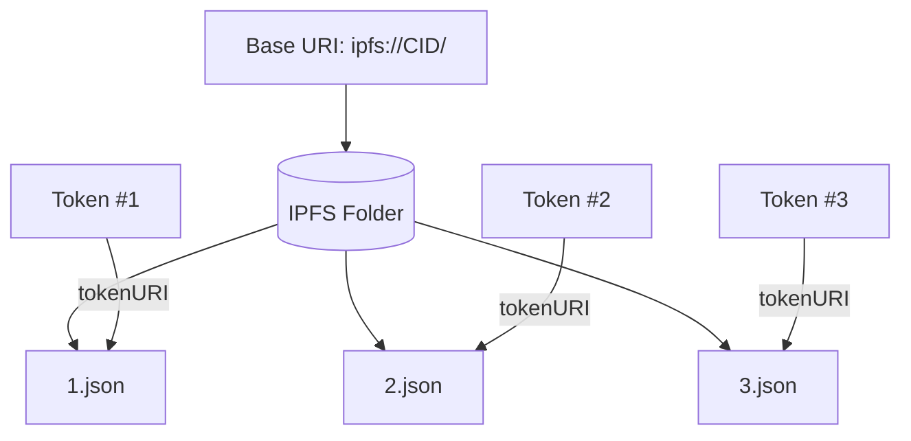
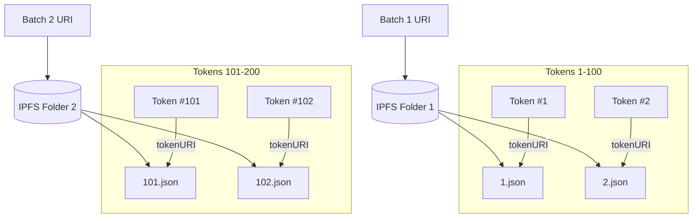

# Fee Model Analysis: AppFactory Architecture

This document analyzes the architectural options and trade-offs for implementing a fee model in the AppFactory system.

## Current Architecture Overview

<FullscreenDiagram>

</FullscreenDiagram>

## Fee Collection Options Analysis

### Option 1: Direct Minting (Current Approach)

Users interact directly with App contracts for minting, bypassing the factory for subsequent operations.

**Pros:**
- Simpler user flow after app creation
- Lower gas costs for minting operations
- App contracts can function independently

**Cons:**
- Factory only collects fees on app creation
- No centralized fee management for minting
- More complex for tracking platform metrics

### Option 2: Factory-Routed Minting

All mint operations go through the factory, which forwards calls to the appropriate app contract.

**Pros:**
- Centralized fee collection
- Consistent platform revenue from all operations
- Better analytics and monitoring capabilities
- Enables platform-wide promotional mechanics

**Cons:**
- Higher gas costs due to extra contract hop
- More complex contract interactions
- Factory becomes a potential bottleneck

### Option 3: Factory-Paid Gas Model

Factory receives payments and handles gas costs for app operations.

**Pros:**
- Predictable costs for users
- Simplified UX with single payment point
- Factory can optimize gas usage across operations
- Enables gas abstraction for users
- Potential for batching operations

**Cons:**
- Factory must carefully manage gas economics
- Risk of underpricing gas in volatile market conditions
- More complex implementation and testing
- Higher upfront costs to deploy

## Gas Cost Comparisons

| Operation | Direct Minting | Factory-Routed | Factory-Paid Gas |
|-----------|----------------|----------------|------------------|
| App Creation | ~500,000 gas | ~500,000 gas | ~500,000 gas |
| Single Mint | ~120,000 gas | ~150,000 gas | ~150,000 gas |
| Batch Mint (10) | ~800,000 gas | ~850,000 gas | ~800,000 gas* |
| URI Update | ~45,000 gas | ~65,000 gas | ~55,000 gas |

*Potential for optimization through batching

## IPFS Content Strategies

### Option 1: Individual Token URIs

**Gas cost per token:** ~20,000 gas (first storage)  
**Flexibility:** Maximum - each token can have completely unique metadata

### Option 2: Base URI with Token ID Suffix

**Gas cost:** ~20,000 gas once for baseURI  
**Flexibility:** Medium - requires consistent naming pattern

### Option 3: Batched Base URIs

**Gas cost:** ~20,000 gas per batch  
**Flexibility:** High - balances efficiency with flexibility

## Recommended Approach

Based on the analysis, the recommended approach is a **hybrid Factory-Paid Gas model using Batched Base URIs**:

1. **App Creation Flow:**
   * User pays a creation fee to the factory
   * Factory deploys and initializes the App contract
   * Factory collects platform fee

2. **Minting Flow:**
   * User sends mint request + fees to factory
   * Factory calculates fee split (platform fee vs App revenue)
   * Factory forwards mint call to App contract and pays gas
   * App executes mint logic and emits necessary events
   * Factory handles any refunds if needed

3. **Content Management:**
   * Off-chain system monitors mint events
   * Content is generated and added to IPFS in batched folders
   * Base URIs are updated periodically in batches (e.g., every 100 tokens)
   * Factory handles gas costs for baseURI updates

This approach provides:
* Centralized fee management
* Simplified user experience
* Gas efficiency through batching
* Flexibility for different App types
* Platform scalability

## Implementation Considerations

1. **Gas Budget Management:**
   - Implement gas price monitoring
   - Set maximum gas price thresholds
   - Calculate fees with sufficient buffer

2. **Batching Strategy:**
   - Optimize batch sizes based on network conditions
   - Implement timeout mechanisms for batch processing
   - Consider priority levels for urgent operations

3. **Failure Handling:**
   - Implement proper revert mechanisms
   - Create recovery paths for failed transactions
   - Design refund logic for users

4. **Security Considerations:**
   - Protect against reentrancy in fee handling
   - Implement proper access controls
   - Design circuit breakers for unexpected market conditions

## Conclusion

The Factory-Paid Gas model with Batched Base URIs strikes the optimal balance between user experience, gas efficiency, and platform revenue generation. While requiring more complex implementation, it provides the most scalable solution for the AppFactory ecosystem as it grows to support thousands of Apps.
