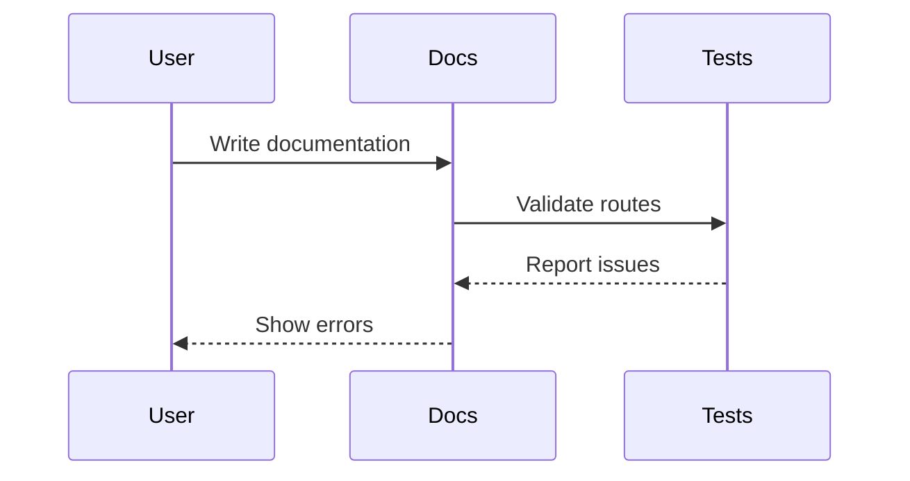
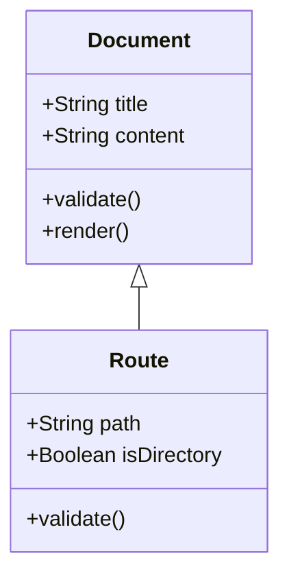

# Examples

This section contains various examples of what you can do with this documentation template.

## Mermaid Diagrams

### Sequence Diagram



### Class Diagram

<FullscreenDiagram>


</FullscreenDiagram>

## Code Blocks

```typescript
interface DocConfig {
  title: string;
  description: string;
  themeConfig: {
    nav: NavItem[];
    sidebar: SidebarConfig;
  }
}
```
