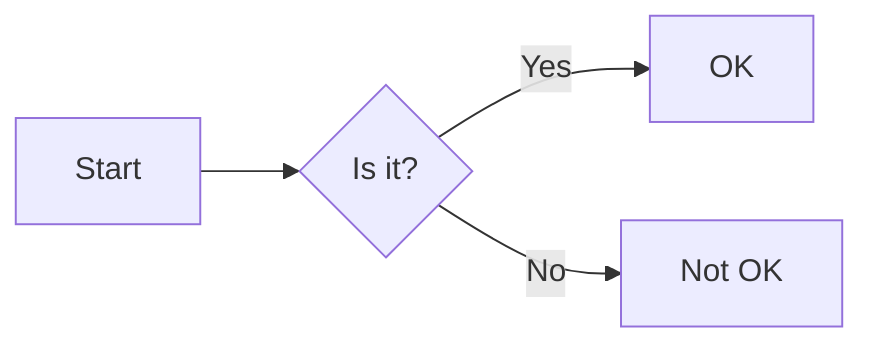
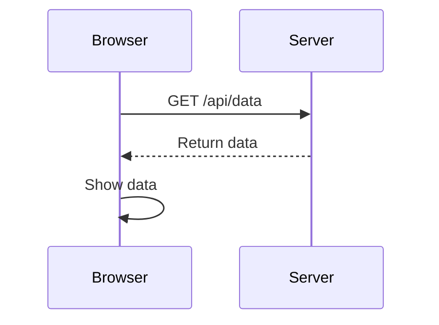
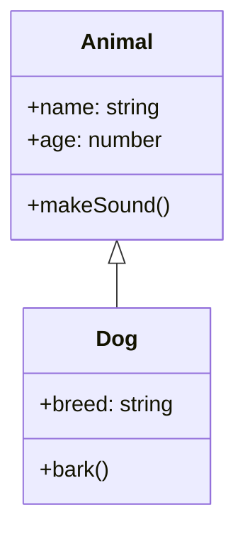
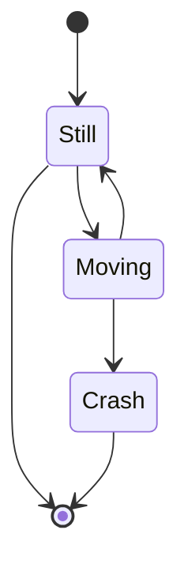

# Mermaid Examples

## Flowchart

```mermaid
graph LR
    A[Start] --> B{Is it?}
    B -- Yes --> C[OK]
    B -- No --> D[Not OK]
```

## Sequence Diagram

```mermaid
sequenceDiagram
    participant Browser
    participant Server
    
    Browser->>Server: GET /api/data
    Server-->>Browser: Return data
    Browser->>Browser: Show data
```

## Class Diagram

```mermaid
classDiagram
    class Animal {
        +name: string
        +age: number
        +makeSound()
    }
    class Dog {
        +breed: string
        +bark()
    }
    Animal <|-- Dog
```

## State Diagram

```mermaid
stateDiagram-v2
    [*] --> Still
    Still --> [*]
    Still --> Moving
    Moving --> Still
    Moving --> Crash
    Crash --> [*]
```
